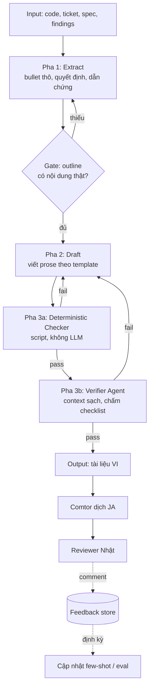

# Kế hoạch Cải thiện Chất lượng Tài liệu Sinh tự động — Forge

> **Phạm vi:** Pipeline sinh tài liệu điều tra (調査書) và thiết kế (設計書) bằng tiếng Việt,
> Comtor dịch sang tiếng Nhật, reviewer Nhật phê duyệt.
>
> **Trạng thái:** Draft v1 — kế hoạch thiết kế, chưa triển khai.

---

## 1. Tóm tắt (結論)

Vấn đề gốc **không phải** thiếu quy tắc, mà là model thiếu **chuẩn tham chiếu** và pipeline thiếu **cơ chế đo**.
Hướng giải quyết: chuyển từ "dồn rule vào prompt" sang **kiến trúc phân tầng** — mỗi loại ràng buộc
được thực thi ở tầng phù hợp nhất, cộng với một **bộ eval** để mọi thay đổi prompt đều đo được.

Ba việc có ROI cao nhất, theo thứ tự:
1. **Xây bộ eval** từ tài liệu thật + comment review của khách.
2. **Few-shot + golden document** thay cho phần lớn rule mô tả.
3. **Deterministic checker** cho mọi thứ script kiểm được.

Kết quả kỳ vọng: prompt sinh giảm ~2/3 độ dài, tỷ lệ tuân thủ *tăng*, và mỗi lần chỉnh prompt
đều biết rõ tốt lên hay xấu đi.

---

## 2. Bối cảnh & Vấn đề hiện tại

### 2.1 Tình trạng
Pipeline hiện dùng prompt template dài (~1500 token) chứa toàn bộ quy tắc: nội dung, văn phong
dễ dịch, trình bày cho reviewer Nhật, cấu trúc mục, và checklist tự kiểm.

### 2.2 Các vấn đề đã xác định

| # | Vấn đề | Nguyên nhân | Mức độ |
|---|---|---|---|
| P1 | Instruction dilution — rule nhiều thì tuân thủ từng rule giảm | Attention phân bổ mỏng; rule giữa prompt bị chìm | Cao |
| P2 | Rule mâu thuẫn ngầm | VD: "câu ≤40 chữ" vs "giải thích lý do thiết kế" | Cao |
| P3 | Điền form cho đủ mục, nội dung rỗng | Over-constraint; mục không có gì để nói vẫn phải điền | Cao |
| P4 | Self-check trong cùng prompt vô hiệu | Model tự chấm bài mình → thiên vị, tick pass mà không sửa | Cao |
| P5 | Mô tả "cái gì" thay vì "tại sao" | Model thiếu context nghiệp vụ/quyết định thiết kế | Cao |
| P6 | Văn phong khó dịch → Comtor dịch sai | Câu dài, lược chủ ngữ, đại từ mơ hồ | Trung bình |
| P7 | Thuật ngữ không nhất quán giữa các tài liệu | Không có glossary nạp động | Trung bình |
| P8 | Token cost cộng dồn qua nhiều agent | Prompt dài lặp lại mỗi lần gọi | Thấp (caching xử lý được) |
| P9 | Không đo được tác động khi sửa prompt | Thiếu eval → chỉnh prompt là đoán mò | Cao |

### 2.3 Không mục tiêu (Non-goals)
- Không thay thế vai trò review của con người.
- Không tự động dịch sang tiếng Nhật (Comtor vẫn đảm nhiệm).
- Không fine-tune model.
- Chưa xử lý các loại tài liệu ngoài 調査書 / 設計書 ở giai đoạn này.

---

## 3. Nguyên tắc thiết kế

1. **Thứ nào máy kiểm được thì không bắt LLM nhớ.**
   Đếm chữ, dò từ cấm, đối chiếu glossary, kiểm mục thiếu → script. Chính xác 100%, 0 token.
2. **Ví dụ mạnh hơn mô tả.**
   Với thứ khó tả bằng lời (văn phong, mức trừu tượng), 1 cặp xấu→tốt > 5 dòng rule.
3. **Tách người sinh và người chấm.**
   Verifier phải là agent riêng, context sạch, không thấy quá trình sinh.
4. **Không đo thì không sửa.**
   Mọi thay đổi prompt phải chạy qua eval trước khi merge.
5. **Rule âm tính rẻ và hiệu quả hơn rule dương tính.**
   "Không được viết X" tuân thủ tốt hơn "hãy viết cho hay".

---

## 4. Thiết kế: Kiến trúc phân tầng

### 4.1 Tổng quan

### 4.2 Phân tầng ràng buộc

| Tầng | Chứa gì | Cơ chế | Ghi chú |
|---|---|---|---|
| **L1 — System prompt** | 5–7 rule cốt lõi, không đổi | Text tĩnh, cache được | Giữ ngắn tối đa |
| **L2 — Few-shot** | Cặp ví dụ xấu→tốt | Nạp theo loại lỗi | Nguồn: feedback khách |
| **L3 — Golden doc** | 1 tài liệu thật đã được duyệt | Reference đầy đủ | Thay cho mô tả cấu trúc |
| **L4 — Skill/template** | Cấu trúc mục theo loại tài liệu | Nạp theo `doc_type` | 調査書 / 設計書 riêng |
| **L5 — Structured output** | Metadata, bảng phương án, danh sách API | JSON schema | Ép được, không cần rule |
| **L6 — Deterministic check** | Độ dài câu, từ cấm, glossary, mục thiếu | Script/regex | Chạy trước verifier |
| **L7 — Verifier agent** | Lập luận có chặt không, lý do có đủ không | LLM, context sạch | Chỉ phần cần phán đoán |

### 4.3 Quyết định thiết kế & lý do

| Quyết định | Lý do | Phương án bị loại |
|---|---|---|
| Tách checker thành script riêng | Chính xác tuyệt đối, 0 token, chạy nhanh | Để LLM tự kiểm — đã chứng minh không hiệu quả (P4) |
| Verifier là agent riêng, context sạch | Tránh thiên vị tự chấm | Cùng agent tự review — bị P4 |
| Sinh 2 pha (extract → draft) | Lộ sớm chỗ không có nội dung thật, chống bịa | Sinh 1 lượt — gây P3 |
| Golden doc thay vì mô tả cấu trúc | Model bám mẫu tốt hơn bám chữ; giữ đúng format khách quen | Mô tả bằng text — dài và mơ hồ |
| Glossary là file riêng nạp động | Nhất quán xuyên tài liệu, sửa 1 chỗ | Hard-code trong prompt — khó bảo trì (P7) |
| Structured output cho phần khung | Ép schema được, không cần rule ngôn ngữ | Prose toàn bộ — khó kiểm |

---

## 5. Các hạng mục kỹ thuật

### 5.1 Bộ eval (ưu tiên cao nhất)

**Mục đích:** Đo được tác động của mọi thay đổi prompt.

- **Dataset:** 5–10 tài liệu thật đã qua review, kèm comment của reviewer.
- **Cấu trúc mỗi case:** `input` (code/ticket/findings) + `expected_signals` (điểm bắt buộc phải có) + `known_issues` (lỗi từng bị review chỉ ra).
- **Chấm điểm:**
  - Deterministic: pass/fail theo checker (mục 5.2).
  - LLM-as-judge: chấm theo rubric, so với golden doc.
  - Thủ công: spot-check định kỳ để hiệu chỉnh judge.
- **Chạy:** mỗi lần sửa prompt → so tỷ lệ pass trước/sau.

### 5.2 Deterministic checker

Script (TypeScript, hợp với stack Forge). Các luật kiểm:

| Luật | Cách kiểm | Hành động khi vi phạm |
|---|---|---|
| Câu > 40 chữ | Tách câu theo `.`/`。`, đếm token | Warning + vị trí |
| Đại từ mơ hồ | Regex: `nó`, `cái này`, `điều đó`, `chúng` | Warning + vị trí |
| Thuật ngữ lệch glossary | Đối chiếu bảng term | Error |
| Mục bắt buộc thiếu | Parse heading, so với template | Error |
| Mục rỗng / chỉ có placeholder | Đếm ký tự nội dung dưới heading | Error |
| Bảng phương án thiếu cột | Parse markdown table | Error |
| Sơ đồ Mermaid thiếu | Tìm code block `mermaid` | Warning |
| Cụm từ sáo rỗng (blacklist) | Regex danh sách đen | Warning |

### 5.3 Glossary động

- Format: YAML — `{ vi, en, ja, note, do_not_translate }`.
- Nguồn: trích từ tài liệu đã duyệt + bổ sung thủ công.
- Dùng ở: prompt (inject phần liên quan), checker (đối chiếu), Comtor (tham chiếu khi dịch).

### 5.4 Few-shot library

- Phân loại theo dạng lỗi: `translation-unfriendly`, `what-not-why`, `vague-conclusion`, `missing-rationale`.
- Mỗi entry: `bad` → `good` → `why` (1 dòng).
- Nạp có chọn lọc theo `doc_type`, không nhét hết.

### 5.5 Feedback loop

- Log comment reviewer Nhật → phân loại dạng lỗi → định kỳ (VD hàng sprint):
  - Lỗi lặp ≥ 3 lần → thêm vào few-shot library hoặc checker.
  - Case điển hình → thêm vào eval dataset.
- Đây là nguồn dữ liệu chất lượng cao nhất và miễn phí.

---

## 6. Kế hoạch triển khai

### Giai đoạn 1 — Nền tảng đo lường
| Việc | Đầu ra |
|---|---|
| Thu thập 5–10 tài liệu thật + comment review | Eval dataset v1 |
| Chọn 1–2 tài liệu tốt nhất làm golden doc | `golden/` |
| Xây rubric chấm điểm | `rubric.md` |
| Chạy baseline với prompt hiện tại | Điểm gốc để so sánh |

> **Gate:** Có baseline số liệu trước khi sửa bất cứ prompt nào.

### Giai đoạn 2 — Deterministic checker
| Việc | Đầu ra |
|---|---|
| Trích glossary v1 từ tài liệu đã duyệt | `glossary.yaml` |
| Viết checker (luật ở mục 5.2) | `doc-checker.ts` |
| Tích hợp vào pipeline sau bước draft | Hook PostToolUse |
| Gỡ các rule đã được checker cover khỏi prompt | Prompt ngắn lại |

> **Gate:** Điểm eval không giảm sau khi gỡ rule.

### Giai đoạn 3 — Few-shot & golden doc
| Việc | Đầu ra |
|---|---|
| Xây few-shot library từ comment review cũ | `fewshot/` theo dạng lỗi |
| Thay phần rule mô tả văn phong bằng few-shot | Prompt gọn hơn |
| Đưa golden doc vào prompt làm reference | — |
| Chạy eval, so với baseline | Báo cáo cải thiện |

### Giai đoạn 4 — Verifier agent riêng
| Việc | Đầu ra |
|---|---|
| Tách checklist tự kiểm ra thành verifier agent | `verifier` sub-agent |
| Định nghĩa vòng lặp draft → verify → sửa (giới hạn N vòng) | Orchestration |
| Chạy eval | Báo cáo |

### Giai đoạn 5 — Sinh 2 pha
| Việc | Đầu ra |
|---|---|
| Tách pha Extract (bullet thô + dẫn chứng) | `extract` agent |
| Structured output cho metadata/bảng/API | JSON schema |
| Gate người duyệt outline trước khi viết prose | — |
| Chạy eval | Báo cáo |

### Giai đoạn 6 — Vận hành
| Việc | Đầu ra |
|---|---|
| Log & phân loại comment reviewer | Feedback store |
| Quy trình định kỳ cập nhật few-shot/eval | Runbook |

---

## 7. Chỉ số đánh giá

| Chỉ số | Cách đo | Mục tiêu |
|---|---|---|
| Tỷ lệ pass deterministic checker | Script | Tăng dần, hướng tới ~100% |
| Số comment review/tài liệu | Đếm từ khách | Giảm |
| Tỷ lệ tài liệu cần viết lại lớn | Đánh giá thủ công | Giảm |
| Số lỗi dịch Comtor báo lại | Log | Giảm |
| Token/tài liệu | Đo pipeline | Giảm (do prompt gọn) |
| Thời gian từ draft đến duyệt | Ticket | Giảm |

---

## 8. Rủi ro

| Rủi ro | Ảnh hưởng | Giảm thiểu |
|---|---|---|
| Eval dataset quá nhỏ → không đại diện | Tối ưu nhầm hướng | Bổ sung dần từ feedback loop; spot-check thủ công |
| LLM-as-judge chấm lệch | Tin nhầm số liệu | Hiệu chỉnh định kỳ bằng chấm tay |
| Checker quá nghiêm → chặn cả output tốt | Pipeline tắc | Chia error/warning; warning không chặn |
| Vòng lặp verify không hội tụ | Tốn token, treo | Giới hạn số vòng, fallback về người |
| Golden doc lỗi thời khi format khách đổi | Sinh sai chuẩn | Review golden doc theo kỳ |
| Chi phí verifier agent | Token tăng | Dùng model rẻ hơn cho verifier; chạy sau checker để lọc bớt |

---

## 9. Vấn đề tồn đọng / Cần xác nhận

- [ ] Có được phép dùng tài liệu thật của khách làm eval dataset không? (vấn đề bảo mật/NDA)
- [ ] Format 調査書/設計書 chuẩn của khách — có bản mẫu chính thức không?
- [ ] Comtor có sẵn glossary đang dùng không? Nếu có thì hợp nhất thay vì làm mới.
- [ ] Ngưỡng chấp nhận cho từng chỉ số ở mục 7 — cần chốt con số cụ thể.
- [ ] Verifier dùng model tier nào — cân đối chi phí và độ chính xác.
- [ ] Có cần hỗ trợ sinh trực tiếp bản tiếng Nhật trong tương lai không? (ảnh hưởng thiết kế glossary)

---

## 10. Phụ lục — Ghi chú kỹ thuật

**Về token cost:** Phần rule tĩnh nên đặt ở đầu prompt để tận dụng prompt caching. Phần biến động
(input, glossary con, few-shot chọn lọc) đặt sau. Đây là lý do L1 phải tách bạch khỏi L2–L4.

**Về vị trí rule:** Rule đặt ở đầu và cuối prompt được tuân thủ tốt hơn rule ở giữa. Nếu buộc phải
giữ rule quan trọng trong prompt dài, đặt ở hai đầu.

**Về mâu thuẫn rule (P2):** Khi hai rule xung đột, model tự chọn một bên và ta không kiểm soát được.
Cách xử lý: nêu rõ thứ tự ưu tiên trong prompt ("khi xung đột, ưu tiên rõ nghĩa hơn ngắn gọn"),
hoặc gỡ một rule và chuyển sang checker dạng warning.
